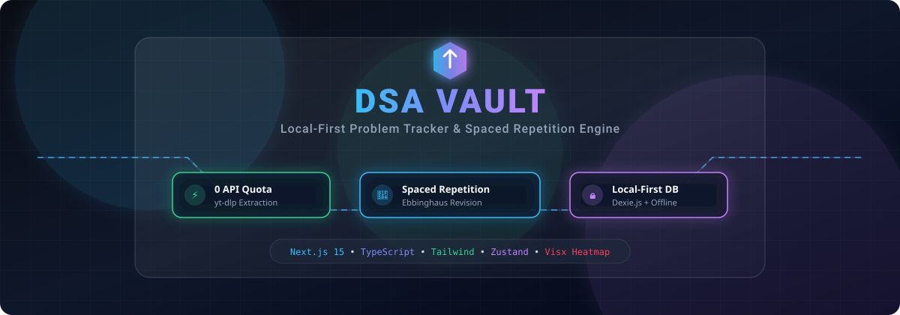
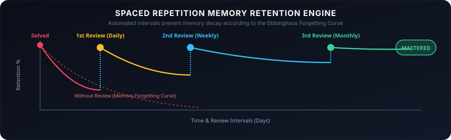

<div align="center">

  <!-- Dynamic SVG Hero Banner -->
  

  <br /><br />

  <!-- Shield Badges Bar -->
  <p align="center">
    <a href="https://nextjs.org"></a>
    <a href="https://react.dev"></a>
    <a href="https://www.typescriptlang.org"></a>
    <a href="https://dexie.org"></a>
    <a href="https://tailwindcss.com"></a>
  </p>

  <p align="center">
    <b>DSA Vault</b> is a local-first, privacy-focused workspace designed for logging coding problems and mastering Data Structures &amp; Algorithms via <b>Spaced Repetition</b>.
  </p>

</div>

---

## 📌 Table of Contents

- [✨ Key Features](#-key-features)
- [🧠 Spaced Repetition Engine](#-spaced-repetition-engine)
- [🚀 Quick Start](#-quick-start)
- [🛠️ Tech Stack](#️-tech-stack)
- [❓ Frequently Asked Questions](#-frequently-asked-questions)

---

## ✨ Key Features

<table>
  <tr>
    <td width="50%" fill="#1e293b">
      <h3>🛡️ Local-First &amp; 100% Offline</h3>
      <p>Your problem data, notes, and study progress stay strictly in your browser using <b>Dexie.js (IndexedDB)</b> and <b>LocalStorage</b>. Zero accounts, zero tracking, zero server latency.</p>
    </td>
    <td width="50%">
      <h3>🧠 Ebbinghaus Spaced Repetition</h3>
      <p>Automated revision schedule based on memory retention curves. Automatically calculates next review dates for <b>Daily (1d)</b>, <b>Weekly (7d)</b>, and <b>Monthly (30d)</b> reviews.</p>
    </td>
  </tr>
  <tr>
    <td width="50%">
      <h3>📊 52-Week Visual Heatmap &amp; Analytics</h3>
      <p>Track your daily coding streak, problem difficulty breakdown (Easy, Medium, Hard), language stats, and total task completions with interactive <b>@visx</b> charts.</p>
    </td>
    <td width="50%">
      <h3>🏆 Competitive Programming &amp; Contests</h3>
      <p>Integrated profile tracking for <b>LeetCode</b>, <b>Codeforces</b>, <b>CodeChef</b>, and <b>AtCoder</b> alongside live contest schedule reminders.</p>
    </td>
  </tr>
  <tr>
    <td width="50%">
      <h3>📁 Problem Groups &amp; Curated Sets</h3>
      <p>Group coding questions into custom sets (e.g., Blind 75, NeetCode 150, Company OA Prep) to practice topic-wise and track group mastery.</p>
    </td>
    <td width="50%">
      <h3>💾 Complete Data Portability</h3>
      <p>One-click <b>JSON Export &amp; Import</b> engine. Backup your entire problem vault or migrate seamlessly across devices with zero data loss.</p>
    </td>
  </tr>
</table>

---

## 🧠 Spaced Repetition Engine

DSA Vault implements the **Ebbinghaus Forgetting Curve** model to ensure you never forget solved problems.

<p align="center">
  
</p>

### 🔄 Revision Workflow
1. **Problem Logged**: You solve a problem (e.g., *Two Sum*) and assign a review frequency (**Daily**, **Weekly**, or **Monthly**).
2. **Automated Calculation**:
   - `Daily`: Next review in **+1 day**
   - `Weekly`: Next review in **+7 days**
   - `Monthly`: Next review in **+30 days**
3. **Due Notification**: When a problem reaches its review date, it automatically appears in **Today's Revision Todos**.
4. **Mastery Progression**: Solved reviews increase retention strength until the problem reaches **Mastered** status.

---

## 🚀 Quick Start

### Prerequisites
- **Node.js**: `v18.0.0` or higher

### 1. Clone &amp; Install Dependencies
```bash
git clone https://github.com/your-username/dsa-vault.git
cd dsa-vault
npm install
```

### 2. Run Development Server
```bash
npm run dev
```

Open [http://localhost:3000](http://localhost:3000) in your browser. The app initializes with sample DSA problems so you can start testing immediately!

---

## 🛠️ Tech Stack

<details open>
<summary><b>📦 Core Frameworks &amp; Libraries</b></summary>

<br />

- **Framework**: [Next.js 15 (App Router)](https://nextjs.org/)
- **Frontend Logic**: [React 19](https://react.dev/) + [TypeScript 5.7](https://www.typescriptlang.org/)
- **State Management**: [Zustand 5](https://github.com/pmndrs/zustand)
- **Local Database**: [Dexie.js](https://dexie.org/) (IndexedDB wrapper)
- **Data Visualization**: [@visx](https://airbnb.io/visx/) heatmap &amp; chart tools
- **Analytics & Insights**: [@vercel/analytics](https://vercel.com/analytics) + [@vercel/speed-insights](https://vercel.com/speed-insights)
- **Styling**: [Tailwind CSS 3.4](https://tailwindcss.com/) + [Lucide Icons](https://lucide.dev/)

</details>

---

## ❓ Frequently Asked Questions

<details>
<summary><b>🔒 Is my data safe &amp; private?</b></summary>
<br />
Yes! DSA Vault operates 100% locally inside your web browser. All problem entries, notes, and settings are stored locally in IndexedDB via Dexie.js. No telemetry or tracking scripts are included.
</details>

<details>
<summary><b>💾 How do I backup my problem vault?</b></summary>
<br />
Navigate to the <b>Settings</b> tab in the app and click <b>Export Data</b>. This downloads a complete <code>dsa_vault_backup.json</code> file containing all your problems, groups, and interval settings.
</details>

<details>
<summary><b>⚙️ Can I customize review intervals?</b></summary>
<br />
Yes! In <b>Settings</b>, you can adjust custom interval lengths for Daily, Weekly, and Monthly reviews (e.g., set Daily to 2 days, Weekly to 10 days, or Monthly to 45 days).
</details>

---

<div align="center">
  <p>Crafted for competitive programmers &amp; software engineers aiming for mastery. 🚀</p>
  <p><b>DSA Vault</b> • <i>Build streaks, master patterns, remember forever.</i></p>
</div>